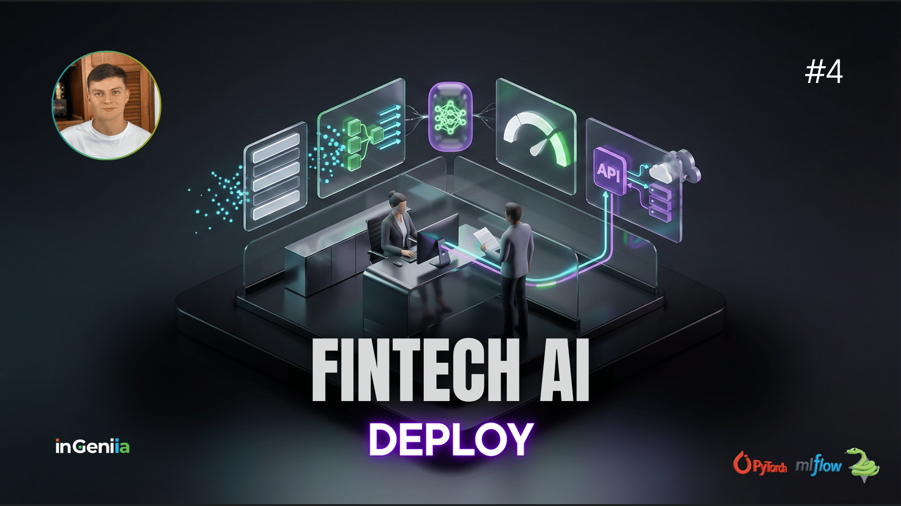
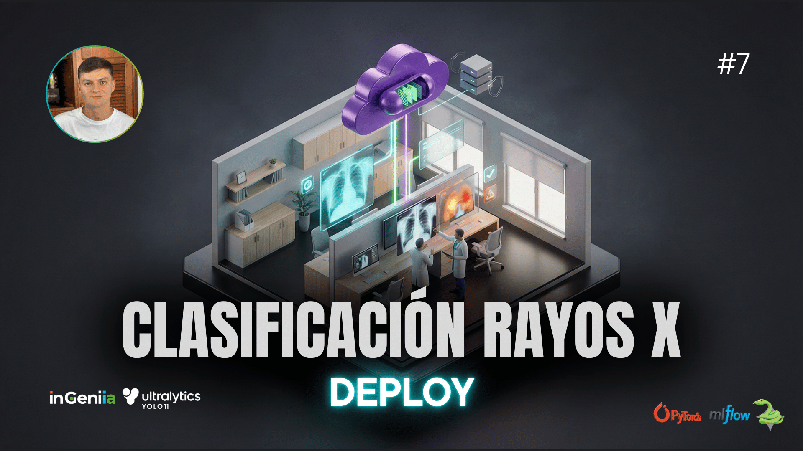
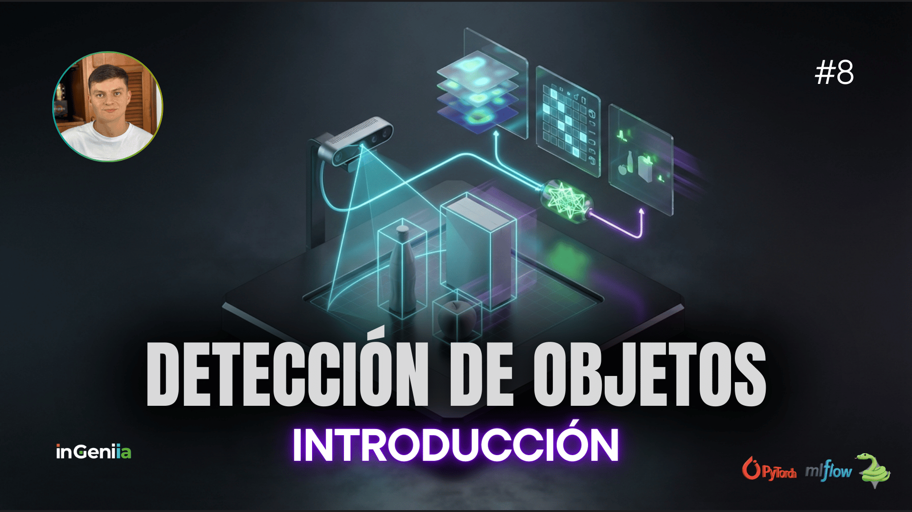

# 🚀 Deep Learning Services: De la Teoría a Producción

[](https://www.ingeniia.co)
[](https://www.ingeniia.co)
[]()

Bienvenido al repositorio oficial de microservicios del **Curso de Deep Learning** de [inGeniia.co](https://www.ingeniia.co).

Este no es otro repositorio de "Jupyter Notebooks muertos". Aquí encontrarás **ingeniería de verdad**: código estructurado, dockerizado y listo para desplegarse en la nube (GCP). Nuestra misión es democratizar el acceso a la Inteligencia Artificial de alta calidad, desarrollada con **talento 100% Colombiano 🇨🇴** para el mundo.

---

## 📂 Estructura del Proyecto

Hemos diseñado una arquitectura profesional para que encuentres fácilmente lo que necesitas. Olvida el código espagueti; esto es MLOps.

```text
deep_learning_services/
├── container-images/       # 🐳 Dockerfiles optimizados para cada microservicio.
├── ops/                    # ☁️ IaC y Cloud Build para despliegues automáticos en GCP.
├── python/                 # 🧠 Lógica pura (Source Code) y Endpoints (FastAPI).
│   ├── credit_scoring/     # Servicio de predicción de riesgo crediticio (MLP).
│   └── xray_classifier/    # Servicio de visión artificial para tórax (CNN).
├── .dockerignore           # Buenas prácticas de construcción.
└── README.md               # Estás aquí.
```

## 🤖 Servicios Disponibles y Datasets
Cada servicio en este repositorio corresponde a un módulo práctico de nuestra plataforma.

<table>
  <tr>
    <td align="center" width="50%">
      <a href="python/credit_scoring/README.md">
        
      </a>
      <br/>
      <b>🪙 Credit Scoring (MLP)</b><br/>
      <a href="python/credit_scoring/README.md">Ver código</a>
    </td>
    <td align="center" width="50%">
      <a href="python/xrays_evaluation/README.md">
        
      </a>
      <br/>
      <b>🩻 X-Rays Evaluation (CNN + YOLO + GradCAM)</b><br/>
      <a href="python/xrays_evaluation/README.md">Ver código</a>
    </td>
    <td align="center" width="50%">
      <a href="python/smart_checkout/README.md">
        
      </a>
      <b>🛒 Smart Checkout (YOLO + WebSockets)</b>
      <a href="python/smart_checkout/README.md">Ver código</a>
  </td>
  </tr>
</table>

### 💾 Datasets
Aquí tienes los enlaces directos a los datos que usamos en HuggingFace para entrenar estos modelos:

| Servicio / Modelo         | Tipo de Red          | Dataset (HuggingFace) 💾                                         | Descripción                                                               |
|---------------------------|----------------------|------------------------------------------------------------------|---------------------------------------------------------------------------|
| Credit Scoring            | MLP (Perceptrón)     | [German Credit Risk](https://huggingface.co/datasets/inGeniia/german-credit-risk_credit-scoring_mlp)     | Predicción de puntajes crediticios basada en datos tabulares.            |
| X-Rays Evaluation     | CNN (YOLO11-cls)     | [Chest X-Rays](https://huggingface.co/datasets/inGeniia/chest-xrays-evaluation_cnn-cls)           | Clasificación de imágenes de tórax para apoyo en diagnóstico médico.     |
| Smart Checkout     | CNN (YOLO26m)     | [Multiple Objects](https://huggingface.co/datasets/inGeniia/multiple-objects_smart-checkout_cnn-det)           | Detección de múltiples objetos en tiempo real simulando un cajero autónomo de supermercado.     |


¿Quieres verlos en acción? Ve a [www.ingeniia.co](https://www.ingeniia.co) e interactúa con estos modelos desplegados en tiempo real.

## 🎓 Ruta de Aprendizaje: Tu Camino a la Maestría en IA
En inGeniia, creemos en dar valor antes de pedir nada a cambio. Por eso, una gran parte de nuestra formación es totalmente gratuita.

### 🎁 Nivel 1: Fundamentos Sólidos (GRATIS)
Accede a estos 7 módulos sin costo y empieza tu carrera hoy mismo:

- Módulo 0: Python Pro, Git, Docker y Configuración de Entorno.

- Módulo 1: MLP (Tu primera red neuronal) + MLOps Básico.

- Módulo 2: CNN Clasificación (Visión por Computador) + Data Augmentation.

- Módulo 3: CNN Detección (Bounding Boxes, YOLO concepts).

- Módulo 4: Redes Siamesas (Reconocimiento facial, Embeddings).

- Módulo 5: Autoencoders (Compresión de datos y Denoising).

- Módulo 6: NLP Básico (Procesamiento de Lenguaje Natural clásico).

- Módulo 7: RNN & LSTM (Series de tiempo y Secuencias).


### 🚀 Nivel 2: Maestría Profesional (PREMIUM)
Para quienes quieren liderar la industria. Profundidad técnica, arquitecturas modernas y escalabilidad masiva:
- Módulo 8: Segmentación Avanzada & OBB (U-Net, DeepLab).

- Módulo 9 & 10: Generación de Imágenes (VAEs & GANs).

- Módulo 11: Diffusion Models (La tecnología detrás de MidJourney/Stable Diffusion).

- Módulo 12 & 13: Transformers & ViTs (El corazón de la IA moderna).

- Módulo 14: LLMs, RAG & Agentes (Crea tus propios GPTs, Vector DBs y Agentes Autónomos).

- Módulo 15: GNNs (Redes Neuronales en Grafos).

- Módulo 16: Modelos Multimodales.

- Módulo 17: Reinforcement Learning.

- Módulo 18: IA Eficiente y Segura en Producción (Quantization, Security, Cost-Optimization).


💡 Invierte en ti: El conocimiento en el Nivel 2 es lo que diferencia a un entusiasta de un Senior AI Engineer.

## 🛠️ Guía Técnica de Despliegue (GCP)
Para llevar estos servicios a la nube, utilizamos un pipeline de CI/CD robusto con Google Cloud Platform.

### Arquitectura del Pipeline
1. Push a GitHub ➔ Activa el disparador.

2. Cloud Build ➔ Construye la imagen Docker ubicada en container-images/.

3. Artifact Registry ➔ Almacena y versiona la imagen.

4. Cloud Run ➔ Despliega el servicio serverless y auto-escalable.


## ❤️ Hecho en Colombia para el mundo
Desarrollado con pasión por el equipo de inGeniia.
Quindío, Colombia 🇨🇴

